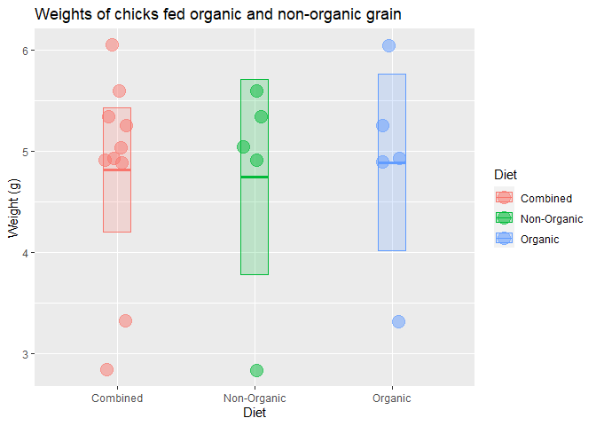

Lab 2 Assignment
================
Connor Hayes
<<<<<<< HEAD
2021-01-21
=======
2021-01-20
>>>>>>> 98cce924a2bde059c06ff8347c870de2e6eda865

## Instructions

Replace any triple underscores "\_\_\_" with the appropriate text.

Copy the appropriate code from your R script
[calculator.R](calculator.R) and paste it into the code chunks below.

## Code Practice

The final section of the Lab 2 instructions asks me to imagine I have
collected a sample of data which consisted of the following values:

    `6.05 4.89 3.32 4.93 5.25 5.04 4.91 2.84 5.60 5.34`

First, I combine the values into a vector using the `c()` function,
assign it to a variable named `x`, and print `x`

<<<<<<< HEAD
k &lt;- c(6.05, 4.89, 3.32, 4.93, 5.25, 5.04, 4.91, 2.84, 5.60, 5.34)

Here I calculate the sample size, mean, median, and standard deviation:

length(k) \# sample size median(k) \# median value mean(k) \# mean value
sd(k) \# standard deviation
=======
``` r
x <- c(6.05, 4.89, 3.32, 4.93, 5.25, 5.04, 4.91, 2.84, 5.60, 5.34)
```

Here I calculate the sample size, mean, median, and standard deviation:

``` r
length(x)
```

    ## [1] 10

``` r
median(x)
```

    ## [1] 4.985

``` r
mean(x)
```

    ## [1] 4.817

``` r
sd(x)
```

    ## [1] 0.9899725
>>>>>>> 98cce924a2bde059c06ff8347c870de2e6eda865

The standard error of the mean can be calculated by dividing the
standard deviation by the square root of the sample size:

<<<<<<< HEAD
sem &lt;- sd(k) / sqrt(k) \# standard error of the mean sem

And finally, I can see the 95% confidence interval ranges from a minimum
of 4.203409 to a maximum of 5.430491 mean(k) + 1.96 \* sem mean(k) -
1.96 \* sem c(mean(k) + 1.96 \* sem, mean(k) - 1.96 \* sem) \# both
limits combined
=======
``` r
n <- length(x)
sem <- sd(x) / sqrt(n)
```

And finally, I can see the 95% confidence interval ranges from a minimum
of 4.203409 to a maximum of 5.43051

``` r
mean(x) + 1.96 * sem 
```

    ## [1] 5.430591

``` r
mean(x) - 1.96 * sem  
```

    ## [1] 4.203409

``` r
c(mean(x) + 1.96 * sem, mean(x) - 1.96 * sem)
```

    ## [1] 5.430591 4.203409
>>>>>>> 98cce924a2bde059c06ff8347c870de2e6eda865

In this assignment I focused on using a single set of numbers, aka a
“vector”.

In the next lab we will begin using data frames, which are tables of
data consisting of multiple vectors.

As an example, imagine that the numbers above represent the weights of
chicks in an experiment. The first five numbers come from chicks that
were fed organic grain while the second were fed non-organic grain.

We could visualize the data as follows.

<<<<<<< HEAD
k &lt;- c(6.05, 4.89, 3.32, 4.93, 5.25, 5.04, 4.91, 2.84, 5.60, 5.34)

library(tidyverse)

# check to make sure you did the part above correctly

# if not, generate some fake x data

if (!exists(“k”) \| !is.numeric(k) \| !length(k) == 10) k &lt;- rep(1,
10)

# put the chick data into a data frame

chick\_data &lt;- tibble::tibble( diet = rep(c(“Combined”, “Combined”,
“Organic”, “Non-Organic”), each = 5), weight = c(k, k) )

# summarize the chick weights by diet

chick\_summary &lt;- chick\_data %&gt;% group\_by(diet) %&gt;%
summarize( mean = mean(weight), median = median(weight), sd =
sd(weight), n = n(), sem = sd / sqrt(n), upper = mean + 1.96 \* sem, \#
upper confidence limit lower = mean - 1.96 \* sem, \# lower confidence
limit .groups = “drop” )

# plot chick weights

ggplot(chick\_data, aes(k = diet, k = weight, color = diet, fill =
diet)) + geom\_jitter(size = 5, shape = 21, alpha = 0.5, width = 0.1) +
geom\_crossbar( mapping = aes(kmin = lower, kmax = upper, k = mean),
data = chick\_summary, width = 0.2, alpha = 0.2 ) + labs( title =
“Weights of chicks fed organic and non-organic grain”, k = “Diet”, color
= “Diet”, fill = “Diet”, y = “Weight (k)” )

    ---
    title: "Lab 2: Introduction to RStudio"
    author: "Connor Hayes"
    date: "2021-01-21"
    output: github_document
    ---

    ```r
    sessioninfo::session_info()

    ## - Session info ---------------------------------------------------------------
    ##  setting  value                       
    ##  version  R version 4.0.3 (2020-10-10)
    ##  os       Windows 10 x64              
    ##  system   x86_64, mingw32             
    ##  ui       RTerm                       
    ##  language (EN)                        
    ##  collate  English_United States.1252  
    ##  ctype    English_United States.1252  
    ##  tz       America/Chicago             
    ##  date     2021-01-21                  
    ## 
    ## - Packages -------------------------------------------------------------------
    ##  package     * version date       lib source        
    ##  assertthat    0.2.1   2019-03-21 [1] CRAN (R 4.0.3)
    ##  cli           2.2.0   2020-11-20 [1] CRAN (R 4.0.3)
    ##  crayon        1.3.4   2017-09-16 [1] CRAN (R 4.0.3)
    ##  digest        0.6.27  2020-10-24 [1] CRAN (R 4.0.3)
    ##  evaluate      0.14    2019-05-28 [1] CRAN (R 4.0.3)
    ##  fansi         0.4.1   2020-01-08 [1] CRAN (R 4.0.3)
    ##  glue          1.4.2   2020-08-27 [1] CRAN (R 4.0.3)
    ##  htmltools     0.5.0   2020-06-16 [1] CRAN (R 4.0.3)
    ##  knitr         1.30    2020-09-22 [1] CRAN (R 4.0.3)
    ##  magrittr      2.0.1   2020-11-17 [1] CRAN (R 4.0.3)
    ##  rlang         0.4.10  2020-12-30 [1] CRAN (R 4.0.3)
    ##  rmarkdown     2.6     2020-12-14 [1] CRAN (R 4.0.3)
    ##  sessioninfo   1.1.1   2018-11-05 [1] CRAN (R 4.0.3)
    ##  stringi       1.5.3   2020-09-09 [1] CRAN (R 4.0.3)
    ##  stringr       1.4.0   2019-02-10 [1] CRAN (R 4.0.3)
    ##  withr         2.3.0   2020-09-22 [1] CRAN (R 4.0.3)
    ##  xfun          0.20    2021-01-06 [1] CRAN (R 4.0.3)
    ##  yaml          2.2.1   2020-02-01 [1] CRAN (R 4.0.3)
    ## 
    ## [1] C:/Users/conno/OneDrive/Documents/R/win-library/4.0
    ## [2] C:/Program Files/R/R-4.0.3/library
=======
``` r
x <- c(6.05, 4.89, 3.32, 4.93, 5.25, 5.04, 4.91, 2.84, 5.60, 5.34)
library(tidyverse)
```

    ## -- Attaching packages --------------------------------------- tidyverse 1.3.0 --

    ## v ggplot2 3.3.3     v purrr   0.3.4
    ## v tibble  3.0.4     v dplyr   1.0.2
    ## v tidyr   1.1.2     v stringr 1.4.0
    ## v readr   1.4.0     v forcats 0.5.0

    ## -- Conflicts ------------------------------------------ tidyverse_conflicts() --
    ## x dplyr::filter() masks stats::filter()
    ## x dplyr::lag()    masks stats::lag()

``` r
# check to make sure you did the part above correctly
# if not, generate some fake x data
if (!exists("x") | !is.numeric(x) | !length(x) == 10) x <- rep(1, 10)

# put the chick data into a data frame
chick_data <-
  tibble::tibble(
    diet = rep(c("Combined", "Combined", "Organic", "Non-Organic"), each = 5),
    weight = c(x, x)
  )

# summarize the chick weights by diet
chick_summary <-
  chick_data %>% 
  group_by(diet) %>% 
  summarize(
    mean = mean(weight),
    median = median(weight),
    sd = sd(weight),
    n = n(),
    sem = sd / sqrt(n),
    upper = mean + 1.96 * sem,   # upper confidence limit
    lower = mean - 1.96 * sem,   # lower confidence limit
    .groups = "drop"
  )

# plot chick weights
ggplot(chick_data, aes(x = diet, y = weight, color = diet, fill = diet)) +
  geom_jitter(size = 5, shape = 21, alpha = 0.5, width = 0.1) +
  geom_crossbar(
    mapping = aes(ymin = lower, ymax = upper, y = mean), 
    data = chick_summary,
    width = 0.2, alpha = 0.2
  ) +
  labs(
    title = "Weights of chicks fed organic and non-organic grain",
    x = "Diet",
    color = "Diet",
    fill = "Diet",
    y = "Weight (g)"
  )
```

<!-- -->
>>>>>>> 98cce924a2bde059c06ff8347c870de2e6eda865
